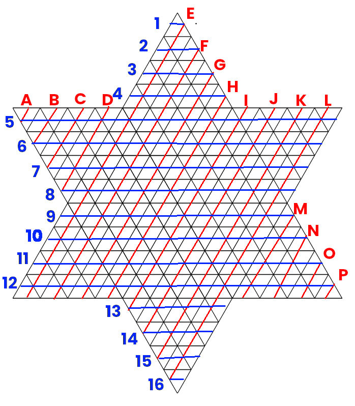

## [Chińskie warcaby](https://en.wikipedia.org/wiki/Chinese_checkers)

Zadanie zaliczeniowa na Technologię Programowania Informatyka Algorytmiczna sem. 3.  

### Autorzy:

- [Krzysztof Nowak](https://github.com/krzysztof9nowak) (frontend, logika gry, utils)
- [Maciej Bazela](https://github.com/Flowyh) (backend, testy, utils)

### Urchomienie

Wykorzystywana wersja Javy: 16

Projekt można uruchomić z poziomu Mavena:
```shell
mvn compile
mvn test
mvn exec:java -Dexec.mainClass="com.laggytrylma.backend.Main" # uruchamia serwer na 0.0.0.0:21375
mvn exec:java -Dexec.mainClass="com.laggytrylma.frontend.Main" # uruchamia klienta (zalecane jest uruchomienie dwóch)
```

lub korzystając z plików .jar znajdujących się w folderze `bin/`
```shell
java -jar bin/server.jar
java -jar bin/client.jar
```

Po uruchomieniu klientów, podajemy nazwy użytkowników oraz łączymy się z serwerem.  
Jeden z klientów powinien stworzyć nową grę, o określonej liczby graczy.   
Nowa gra, z możliwością dołączenia, pojawi się na liście gier pozostałych klientów.  
W momencie, gdy dołączy odpowiednia liczba graczy, gra rozpoczyna się.

### Użyte biblioteki:

* [miglayout](https://mvnrepository.com/artifact/com.miglayout/miglayout) - layout manager (UI)
* [junit](https://mvnrepository.com/artifact/junit/junit) - testy
* [mockito](https://mvnrepository.com/artifact/org.mockito/mockito-core) - testy
* [jackson](https://mvnrepository.com/artifact/com.fasterxml.jackson.core/jackson-core) - serializacja do JSON

### Wykorzystane wzorce projektowe:

* [builder/abstract builder](https://en.wikipedia.org/wiki/Builder_pattern)
* [singleton](https://en.wikipedia.org/wiki/Singleton_pattern)
* [state](https://en.wikipedia.org/wiki/State_pattern)
* [command](https://en.wikipedia.org/wiki/Command_pattern)

### Nasze atuty:
* Proste dodawanie nowych komponentów dzięki użyciu zalecanych wzorców projektowych (np. buildery, command pattern).
* Projekt został tworzony w workflow gitowym [gitflow](https://www.atlassian.com/git/tutorials/comparing-workflows/gitflow-workflow).
* Aplikacja pozwala na tworzenie kilku gier jednocześnie na serwerze.
* Serializacja do JSON pozwala na szybkie stworzenie interfejsu webowego dla gry (w trakcie).
* Korzystamy z systemu współrzędnych opartych na trójkątach:
 
